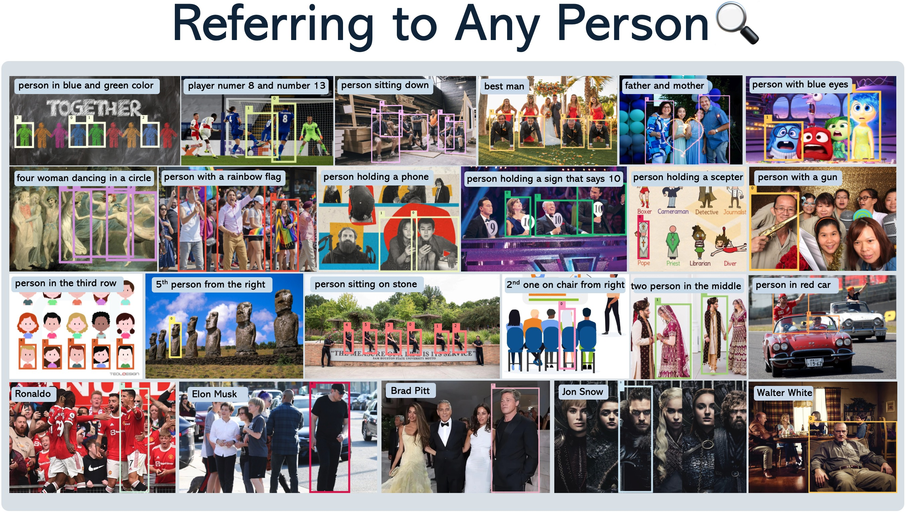

<div align=center>
  
</div>


<div align=center>

 [](https://arxiv.org/abs/2411.18363)  [](https://hits.seeyoufarm.com)

</div>

----

# Contents
- [Contents](#contents)
- [1. Introduction 📚](#1-introduction-)
- [2. Installation 🛠️](#2-installation-️)
  - [2.1 Download Pre-trained Models](#21-download-pre-trained-models)
  - [2.2 Verify Installation](#22-verify-installation)
- [3. Usage 🚀](#3-usage-)
  - [3.1 Use UPN for Object Proposal Generation](#31-use-upn-for-object-proposal-generation)
  - [3.2 Usage of ChatRex](#32-usage-of-chatrex)
    - [3.2.1 ChatRex for Object Detection \& Grounding \& Referring](#321-chatrex-for-object-detection--grounding--referring)
    - [3.2.2 ChatRex for Region Caption](#322-chatrex-for-region-caption)
    - [3.2.3 ChatRex for Grounded Image Captioning](#323-chatrex-for-grounded-image-captioning)
    - [3.2.4 ChatRex for Grounded Conversation](#324-chatrex-for-grounded-conversation)
- [4. Gradio Demos 🎨](#4-gradio-demos-)
  - [4.1 Gradio Demo for UPN](#41-gradio-demo-for-upn)
  - [4.2 Gradio Demo for ChatRex](#42-gradio-demo-for-chatrex)
- [5. RexVerse-2M Dataset](#5-rexverse-2m-dataset)
- [6. LICENSE](#5-license)
- [BibTeX 📚](#bibtex-)

----

# News
- 2025-1-23: RexVerse-2M dataset is now available at [https://huggingface.co/datasets/IDEA-Research/Rexverse-2M](https://huggingface.co/datasets/IDEA-Research/Rexverse-2M)

# 1. Introduction 📚
**TL;DR: ChatRex is an MLLM skilled in perception that can respond to questions while simultaneously grounding its answers to the referenced objects.**

<!-- Add a video here -->
[](https://github.com/user-attachments/assets/03d7e0af-1808-4ce8-bc67-854cf40a4972)

ChatRex is a Multimodal Large Language Model (MLLM) designed to seamlessly integrate fine-grained object perception and robust language understanding. By adopting a decoupled architecture with a retrieval-based approach for object detection and leveraging high-resolution visual inputs, ChatRex addresses key challenges in perception tasks. It is powered by the Rexverse-2M dataset with diverse image-region-text annotations. ChatRex can be applied to various scenarios requiring fine-grained perception, such as object detection, grounded conversation, grounded image captioning and region
understanding.

<div align=center>
  
</div>

----

# 2. Installation 🛠️
```bash
conda install -n chatrex python=3.9
pip install torch==2.1.2 torchvision==0.16.2 --index-url https://download.pytorch.org/whl/cu121
pip install -v -e .
# install deformable attention for universal proposal network
cd chatrex/upn/ops
pip install -v -e .
```

## 2.1 Download Pre-trained Models
We provide model checkpoints for both the ***Universal Proposal Network (UPN)*** and the ***ChatRex model***. You can download the pre-trained models from the following links:
- [UPN Checkpoint](https://github.com/IDEA-Research/ChatRex/releases/download/upn-large/upn_large.pth)
- [ChatRex-7B Checkpoint](https://huggingface.co/IDEA-Research/ChatRex-7B)

Or you can also using the following command to download the pre-trained models:
```bash
mkdir checkpoints
mkdir checkpoints/upn
# download UPN checkpoint
wget -O checkpoints/upn/upn_large.pth https://github.com/IDEA-Research/ChatRex/releases/download/upn-large/upn_large.pth
# Download ChatRex checkpoint from Hugging Face
git lfs install
git clone https://huggingface.co/IDEA-Research/ChatRex-7B checkpoints/chatrex
```

## 2.2 Verify Installation
To verify the ***installation of the Universal Proposal Network (UPN)***, run the following command:
```bash
python tests/test_upn_install.py
```

If the installation is successful, you will get two visualization images of both fine-grained proposal and coarse-grained proposal in `tests` folder.

To verify the ***installation of the ChatRex model***, run the following command:
```bash
python tests/test_chatrex_install.py
```

If the installation is successful, you will get an output like this:
```text
prediction: <obj0> shows a brown dog lying on a bed. The dog is resting comfortably, possibly sleeping, and is positioned on the left side of the bed
```

# 3. Usage 🚀
## 3.1 Use UPN for Object Proposal Generation

Universal Proposal Network (UPN) is a robust object proposal model designed as part of ChatRex to enable comprehensive and accurate object detection across diverse granularities and domains. Built upon T-Rex2, UPN is a DETR-based model with a dual-granularity prompt tuning strategy, combining fine-grained (e.g., part-level) and coarse-grained (e.g., instance-level) detection.

<div align=center>
  
</div>

----

<details close>
<summary><strong>Example Code for UPN</strong></summary>

```python
import torch
from PIL import Image
from tools.visualize import plot_boxes_to_image
from chatrex.upn import UPNWrapper

ckpt_path = "checkpoints/upn_checkpoints/upn_large.pth"
test_image_path = "tests/images/test_upn.jpeg"

model = UPNWrapper(ckpt_path)
# fine-grained prompt
fine_grained_proposals = model.inference(
    test_image_path, prompt_type="fine_grained_prompt"
)
# filter by score (default: 0.3) and nms (default: 0.8)
fine_grained_filtered_proposals = model.filter(
    fine_grained_proposals, min_score=0.3, nms_value=0.8
)
## output is a dict with keys: "original_xyxy_boxes", "scores"
## - "original_xyxy_boxes": list of boxes in xyxy format in shape (B, N, 4)
## - "scores": list of scores for each box in shape (B, N)

# coarse-grained prompt
coarse_grained_proposals = model.inference(
    test_image_path, prompt_type="coarse_grained_prompt"
)
coarse_grained_filtered_proposals = model.filter(
    coarse_grained_proposals, min_score=0.3, nms_value=0.8
)

## output is a dict with keys: "original_xyxy_boxes", "scores"
## - "original_xyxy_boxes": list of boxes in xyxy format in shape (B, N, 4)
## - "scores": list of scores for each box in shape (B, N)
```

</details>

We also provide a visualization tool to visualize the object proposals generated by UPN. You can use the following code to visualize the object proposals:

<details close>
<summary><strong>Example Code for UPN Visualization</strong></summary>

```python

from chatrex.tools.visualize import plot_boxes_to_image
image = Image.open(test_image_path)
fine_grained_vis_image, _ = plot_boxes_to_image(
    image.copy(),
    fine_grained_filtered_proposals["original_xyxy_boxes"][0],
    fine_grained_filtered_proposals["scores"][0],
)
fine_grained_vis_image.save("tests/test_image_fine_grained.jpeg")
print(f"fine-grained proposal is saved at tests/test_image_fine_grained.jpeg")

coarse_grained_vis_image, _ = plot_boxes_to_image(
    image.copy(),
    coarse_grained_filtered_proposals["original_xyxy_boxes"][0],
    coarse_grained_filtered_proposals["scores"][0],
)
coarse_grained_vis_image.save("tests/test_image_coarse_grained.jpeg")
print(f"coarse-grained proposal is saved at tests/test_image_coarse_grained.jpeg")

```
</details>

## 3.2 Usage of ChatRex

ChatRex takes three inputs: image, text prompt, and box input. For the box input, you can either use the object proposals generated by UPN or provide your own box input (user drawn boxes). We have wrapped the ChatRex model to huggingface transformers format for easy usage. ChatRex can be used for various tasks and we provide example code for each task below.

### 3.2.1 ChatRex for Object Detection & Grounding & Referring

Example Prompt for detection, grounding, referring tasks:
```text
# Single Object Detection
Please detect dog in this image. Answer the question with object indexes.
Please detect the man in yellow shirt in this image. Answer the question with object indexes.

# multiple object detection, use ; to separate the objects
Please detect person; pigeon in this image. Answer the question with object indexes.
Please detect person in the car; cat below the table in this image. Answer the question with object indexes.
```

<details close>
<summary><strong>Example Code</strong></summary>

- [Example Code in python file](tests/test_chatrex_detection.py)

```python
import torch
from PIL import Image
from transformers import AutoModelForCausalLM, AutoProcessor, GenerationConfig

from chatrex.tools.visualize import visualize_chatrex_output
from chatrex.upn import UPNWrapper

if __name__ == "__main__":
    # load the processor
    processor = AutoProcessor.from_pretrained(
        "IDEA-Research/ChatRex-7B",
        trust_remote_code=True,
        device_map="cuda",
    )

    print(f"loading chatrex model...")
    # load chatrex model
    model = AutoModelForCausalLM.from_pretrained(
        "IDEA-Research/ChatRex-7B",
        trust_remote_code=True,
        use_safetensors=True,
    ).to("cuda")

    # load upn model
    print(f"loading upn model...")
    ckpt_path = "checkpoints/upn_checkpoints/upn_large.pth"
    model_upn = UPNWrapper(ckpt_path)
    test_image_path = "tests/images/test_chatrex_detection.jpg"

    # get upn predictions
    fine_grained_proposals = model_upn.inference(
        test_image_path, prompt_type="fine_grained_prompt"
    )
    fine_grained_filtered_proposals = model_upn.filter(
        fine_grained_proposals, min_score=0.3, nms_value=0.8
    )

    inputs = processor.process(
        image=Image.open(test_image_path),
        question="Please detect person; pigeon in this image. Answer the question with object indexes.",
        bbox=fine_grained_filtered_proposals["original_xyxy_boxes"][
            0
        ],  # box in xyxy format
    )

    inputs = {k: v.to("cuda") for k, v in inputs.items()}

    # perform inference
    gen_config = GenerationConfig(
        max_new_tokens=512,
        do_sample=False,
        eos_token_id=processor.tokenizer.eos_token_id,
        pad_token_id=(
            processor.tokenizer.pad_token_id
            if processor.tokenizer.pad_token_id is not None
            else processor.tokenizer.eos_token_id
        ),
    )
    with torch.autocast(device_type="cuda", enabled=True, dtype=torch.bfloat16):
        prediction = model.generate(
            inputs, gen_config=gen_config, tokenizer=processor.tokenizer
        )
    print(f"prediction:", prediction)

    # visualize the prediction
    vis_image = visualize_chatrex_output(
        Image.open(test_image_path),
        fine_grained_filtered_proposals["original_xyxy_boxes"][0],
        prediction,
        font_size=15,
        draw_width=5,
    )
    vis_image.save("tests/test_chatrex_detection.jpeg")
    print(f"prediction is saved at tests/test_chatrex_detection.jpeg")
```

The output from LLM is like:
```text
<ground>person</ground><objects><obj10><obj14><obj15><obj27><obj28><obj32><obj33><obj35><obj38><obj47><obj50></objects>
<ground>pigeon</ground><objects><obj0><obj1><obj2><obj3><obj4><obj5><obj6><obj7><obj8><obj9><obj11><obj12><obj13><obj16><obj17><obj18><obj19><obj20><obj21><obj22><obj23><obj24><obj25><obj26><obj29><obj31><obj37><obj39><obj40><obj41><obj44><obj49></objects>
```

The visualization of the output is like:

<div align=center>
  
</div>

</details>

----

### 3.2.2 ChatRex for Region Caption
Example Prompt for Region Caption tasks:

```text
# Single Object Detection
## caption in category name
What is the category name of <obji>? Answer the question with its category name in free format.

## caption in short phrase
Can you provide me with a short phrase to describe <obji>? Answer the question with a short phrase.

## caption in referring style
Can you provide me with a brief description of <obji>? Answer the question with brief description.

## caption in one sentence
Can you provide me with a one sentence of <obji>? Answer the question with one sentence description.

# multiple object detection, use ; to separate the objects
```

<details close>
<summary><strong>Example Code</strong></summary>

- [Example Code in python file](tests/test_chatrex_region_caption.py)

```python
import torch
from PIL import Image
from transformers import AutoModelForCausalLM, AutoProcessor, GenerationConfig

from chatrex.tools.visualize import visualize_chatrex_output
from chatrex.upn import UPNWrapper

if __name__ == "__main__":
    # load the processor
    processor = AutoProcessor.from_pretrained(
        "IDEA-Research/ChatRex-7B",
        trust_remote_code=True,
        device_map="cuda",
    )

    print(f"loading chatrex model...")
    # load chatrex model
    model = AutoModelForCausalLM.from_pretrained(
        "IDEA-Research/ChatRex-7B",
        trust_remote_code=True,
        use_safetensors=True,
    ).to("cuda")

    test_image_path = "tests/images/test_chatrex_install.jpg"

    inputs = processor.process(
        image=Image.open(test_image_path),
        question="Can you provide a one sentence description of <obj0> in the image? Answer the question with a one sentence description.",
        bbox=[[73.88417, 56.62228, 227.69223, 216.34338]],
    )

    inputs = {k: v.to("cuda") for k, v in inputs.items()}

    # perform inference
    gen_config = GenerationConfig(
        max_new_tokens=512,
        do_sample=False,
        eos_token_id=processor.tokenizer.eos_token_id,
        pad_token_id=(
            processor.tokenizer.pad_token_id
            if processor.tokenizer.pad_token_id is not None
            else processor.tokenizer.eos_token_id
        ),
    )
    with torch.autocast(device_type="cuda", enabled=True, dtype=torch.bfloat16):
        prediction = model.generate(
            inputs, gen_config=gen_config, tokenizer=processor.tokenizer
        )
    print(f"prediction:", prediction)

    # visualize the prediction
    vis_image = visualize_chatrex_output(
        Image.open(test_image_path),
        [[73.88417, 56.62228, 227.69223, 216.34338]],
        prediction,
        font_size=15,
        draw_width=5,
    )
    vis_image.save("tests/test_chatrex_region_caption.jpeg")
    print(f"prediction is saved at tests/test_chatrex_region_caption.jpeg")
```

The output from LLM is like:
```text
<ground>A brown dog is lying on a bed, appearing relaxed and comfortable</ground><objects><obj0></objects>
```

The visualization of the output is like:

<div align=center>
  
</div>

</details>

----

### 3.2.3 ChatRex for Grounded Image Captioning
Example Prompt for Region Caption tasks:

```text
# Brief Grounded Imager Caption
Please breifly describe this image in one sentence and detect all the mentioned objects. Answer the question with grounded answer.

# Detailed Grounded Image Caption
Please provide a detailed description of the image and detect all the mentioned objects. Answer the question with grounded object indexes.
```

<details close>
<summary><strong>Example Code</strong></summary>

- [Example Code in python file](tests/test_chatrex_grounded_image_caption.py)

```python
import torch
from PIL import Image
from transformers import AutoModelForCausalLM, AutoProcessor, GenerationConfig

from chatrex.tools.visualize import visualize_chatrex_output
from chatrex.upn import UPNWrapper

if __name__ == "__main__":
    # load the processor
    processor = AutoProcessor.from_pretrained(
        "IDEA-Research/ChatRex-7B",
        trust_remote_code=True,
        device_map="cuda",
    )

    print(f"loading chatrex model...")
    # load chatrex model
    model = AutoModelForCausalLM.from_pretrained(
        "IDEA-Research/ChatRex-7B",
        trust_remote_code=True,
        use_safetensors=True,
    ).to("cuda")

    # load upn model
    print(f"loading upn model...")
    ckpt_path = "checkpoints/upn_checkpoints/upn_large.pth"
    model_upn = UPNWrapper(ckpt_path)
    test_image_path = "tests/images/test_chatrex_grounded_caption.jpg"

    # get upn predictions
    fine_grained_proposals = model_upn.inference(
        test_image_path, prompt_type="fine_grained_prompt"
    )
    fine_grained_filtered_proposals = model_upn.filter(
        fine_grained_proposals, min_score=0.3, nms_value=0.8
    )

    inputs = processor.process(
        image=Image.open(test_image_path),
        question="Please breifly describe this image in one sentence and detect all the mentioned objects. Answer the question with grounded answer.",
        bbox=fine_grained_filtered_proposals["original_xyxy_boxes"][
            0
        ],  # box in xyxy format
    )

    inputs = {k: v.to("cuda") for k, v in inputs.items()}

    # perform inference
    gen_config = GenerationConfig(
        max_new_tokens=512,
        do_sample=False,
        eos_token_id=processor.tokenizer.eos_token_id,
        pad_token_id=(
            processor.tokenizer.pad_token_id
            if processor.tokenizer.pad_token_id is not None
            else processor.tokenizer.eos_token_id
        ),
    )
    with torch.autocast(device_type="cuda", enabled=True, dtype=torch.bfloat16):
        prediction = model.generate(
            inputs, gen_config=gen_config, tokenizer=processor.tokenizer
        )
    print(f"prediction:", prediction)

    # visualize the prediction
    vis_image = visualize_chatrex_output(
        Image.open(test_image_path),
        fine_grained_filtered_proposals["original_xyxy_boxes"][0],
        prediction,
        font_size=15,
        draw_width=5,
    )
    vis_image.save("tests/test_chatrex_grounded_image_caption.jpeg")
    print(f"prediction is saved at tests/test_chatrex_grounded_image_caption.jpeg")
```

The output from LLM is like:
```text
The image depicts a cozy living room with a <ground>plaid couch,</ground><objects><obj2></objects> a <ground>wooden TV stand</ground><objects><obj3></objects>holding a <ground>black television,</ground><objects><obj1></objects> a <ground>red armchair,</ground><objects><obj4></objects> and a <ground>whiteboard</ground><objects><obj0></objects>with writing on the wall, accompanied by a <ground>framed poster</ground><objects><obj6></objects>of a <ground>couple.</ground><objects><obj9><obj11></objects>
```

The visualization of the output is like:

<div align=center>
  
</div>

</details>

----

### 3.2.4 ChatRex for Grounded Conversation
Example Prompt for Region Caption tasks:

```text
Answer the question in Grounded format. Question
```

<details close>
<summary><strong>Example Code</strong></summary>

- [Example Code in python file](tests/test_chatrex_grounded_conversation.py)

```python
import torch
from PIL import Image
from transformers import AutoModelForCausalLM, AutoProcessor, GenerationConfig

from chatrex.tools.visualize import visualize_chatrex_output
from chatrex.upn import UPNWrapper

if __name__ == "__main__":
    # load the processor
    processor = AutoProcessor.from_pretrained(
        "IDEA-Research/ChatRex-7B",
        trust_remote_code=True,
        device_map="cuda",
    )

    print(f"loading chatrex model...")
    # load chatrex model
    model = AutoModelForCausalLM.from_pretrained(
        "IDEA-Research/ChatRex-7B",
        trust_remote_code=True,
        use_safetensors=True,
    ).to("cuda")

    # load upn model
    print(f"loading upn model...")
    ckpt_path = "checkpoints/upn_checkpoints/upn_large.pth"
    model_upn = UPNWrapper(ckpt_path)
    test_image_path = "tests/images/test_grounded_conversation.jpg"

    # get upn predictions
    fine_grained_proposals = model_upn.inference(
        test_image_path, prompt_type="coarse_grained_prompt"
    )
    fine_grained_filtered_proposals = model_upn.filter(
        fine_grained_proposals, min_score=0.3, nms_value=0.8
    )

    inputs = processor.process(
        image=Image.open(test_image_path),
        question="Answer the question in grounded format. This is a photo of my room, and can you tell me what kind of person I am?  ",
        bbox=fine_grained_filtered_proposals["original_xyxy_boxes"][
            0
        ],  # box in xyxy format
    )

    inputs = {k: v.to("cuda") for k, v in inputs.items()}

    # perform inference
    gen_config = GenerationConfig(
        max_new_tokens=512,
        do_sample=False,
        eos_token_id=processor.tokenizer.eos_token_id,
        pad_token_id=(
            processor.tokenizer.pad_token_id
            if processor.tokenizer.pad_token_id is not None
            else processor.tokenizer.eos_token_id
        ),
    )
    with torch.autocast(device_type="cuda", enabled=True, dtype=torch.bfloat16):
        prediction = model.generate(
            inputs, gen_config=gen_config, tokenizer=processor.tokenizer
        )
    print(f"prediction:", prediction)

    # visualize the prediction
    vis_image = visualize_chatrex_output(
        Image.open(test_image_path),
        fine_grained_filtered_proposals["original_xyxy_boxes"][0],
        prediction,
        font_size=30,
        draw_width=10,
    )
    vis_image.save("tests/test_chatrex_grounded_conversation.jpeg")
    print(f"prediction is saved at tests/test_chatrex_grounded_conversation.jpeg")

```

The output from LLM is like:
```text
Based on the items in the image, it can be inferred that the <ground>person</ground><objects><obj1></objects> who owns this room has an interest in fitness and possibly enjoys reading. The presence of the <ground>dumbbell</ground><objects><obj2></objects> suggests a commitment to physical activity, while the <ground>book</ground><objects><obj3></objects> indicates a liking for literature or reading. The <ground>sneaker</ground><objects><obj0></objects>s and the <ground>plush toy</ground><objects><obj1></objects> add a personal touch, suggesting that the <ground>person</ground><objects><obj1></objects> might also value comfort and perhaps has a playful or nostalgic side. However, without more context, it is not possible to accurately determine the individual's specific traits or <ground>person</ground><objects><obj1></objects>ality.
```

The visualization of the output is like:

<div align=center>
  
</div>

</details>

----

# 4. Gradio Demos 🎨
Here are [Workflow Readme](gradio_demos/gradio.md) you can follow to run the gradio demos.

## 4.1 Gradio Demo for UPN
We provide a gradio demo for UPN to visualize the object proposals generated by UPN. You can run the following command to start the gradio demo:
```bash
python gradio_demos/upn_demo.py
# if there is permission error, please run the following command
mkdir tmp
TMPDIR='/tmp' python gradio_demos/upn_demo.py
```

<div align=center>
  
</div>


## 4.2 Gradio Demo for ChatRex
We also provide a gradio demo for ChatRex. Before you use, we highly recommend you to watch the following video to understand how to use this demo:

<!-- Add a video here -->
[](https://github.com/user-attachments/assets/945e192f-59e3-4c84-8615-20343378279a)

```bash
python gradio_demos/chatrex_demo.py
# if there is permission error, please run the following command
mkdir tmp
TMPDIR='/tmp' python gradio_demos/upn_demo.py
```

<div align=center>
  
</div>

# RexVerse-2M Dataset
- We have released 500K data samples of RexVerse-2M dataset. You can download the dataset from [Hugging Face](https://huggingface.co/datasets/IDEA-Research/Rexverse-2M)


# 6. LICENSE

ChatRex is licensed under the IDEA License 1.0, Copyright (c) IDEA. All Rights Reserved. Note that this project utilizes certain datasets and checkpoints that are subject to their respective original licenses. Users must comply with all terms and conditions of these original licenses including but not limited to the:
- [OpenAI Terms of Use](https://openai.com/policies/terms-of-use) for the dataset. 
- For the LLM used in this project, the model is [lmsys/vicuna-7b-v1.5](https://huggingface.co/lmsys/vicuna-7b-v1.5/tree/main), which is licensed under [Llama 2 Community License Agreement](https://huggingface.co/lmsys/vicuna-7b-v1.5).
- For the high resolution vision encoder, we are using [laion/CLIP-convnext_large_d.laion2B-s26B-b102K-augreg](https://huggingface.co/laion/CLIP-convnext_large_d.laion2B-s26B-b102K-augreg) which is licensed under [MIT LICENSE](https://huggingface.co/datasets/choosealicense/licenses/blob/main/markdown/mit.md).
- For the low resolution vision encoder, we are using [openai/clip-vit-large-patch14](https://huggingface.co/openai/clip-vit-large-patch14) which is licensed under [MIT LICENSE](https://github.com/openai/CLIP/blob/main/LICENSE)
# BibTeX 📚
```
@misc{jiang2024chatrextamingmultimodalllm,
      title={ChatRex: Taming Multimodal LLM for Joint Perception and Understanding}, 
      author={Qing Jiang and Gen luo and Yuqin Yang and Yuda Xiong and Yihao Chen and Zhaoyang Zeng and Tianhe Ren and Lei Zhang},
      year={2024},
      eprint={2411.18363},
      archivePrefix={arXiv},
      primaryClass={cs.CV},
      url={https://arxiv.org/abs/2411.18363}, 
}
```
